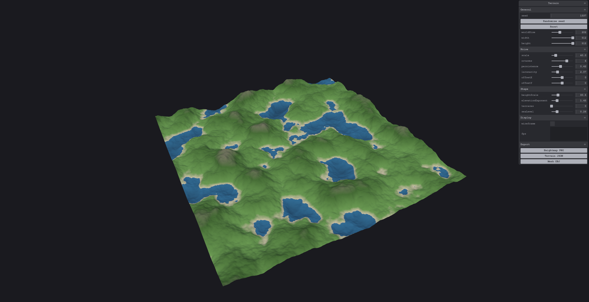

# Terrain Forge

Procedural terrain generator for game developers. A standalone desktop app: live 3D preview, hand-written noise, and exports you can drop straight into Unity/UE/Godot. Fully offline — no backend, no database, no accounts.



## Features

- Live Three.js preview with orbit controls
- Perlin / fractal-Brownian-motion noise written from scratch (seeded, deterministic)
- Adjustable parameters: seed, world size, resolution, scale, octaves, persistence, lacunarity, noise offset, height scale, elevation curve, terraces, sea level
- Elevation-based colouring (water, sand, grass, rock, snow)
- Exports:
  - **Heightmap PNG** — 16-bit greyscale, range-normalised
  - **Terrain JSON** — normalised heights + world-space metadata + full parameter set
  - **Mesh OBJ** — ready-to-use mesh with smooth normals

## Getting started

```bash
npm install
npm start
```

## Scripts

| Command | Description |
| --- | --- |
| `npm start` | Run the app in development with hot reload |
| `npm run build` | Build the production bundle into `out/` |
| `npm run typecheck` | Type-check main, preload and renderer |
| `npm run lint` | Lint the codebase |
| `npm test` | Run the unit tests |

## Export formats

All three exports describe the same grid. World-space position of sample `(col, row)`:

```
worldX = (col / (width - 1) - 0.5) * worldSize
worldZ = (row / (height - 1) - 0.5) * worldSize
```

**Heightmap PNG** and **Terrain JSON** store normalised heights `h in [0, 1]` stretched to the used range. Absolute elevation:

```
worldY = minHeight + h * (maxHeight - minHeight)
```

`minHeight` / `maxHeight` (world units) are in the JSON. In the PNG, `h = pixel / 65535`. In the JSON, `heights[row * width + col]`.

**Mesh OBJ** is already in world units, Y-up, with smooth normals — import and use directly.

## Architecture

```
src/
  main/        Electron main process: window + file-save IPC handler
  preload/     contextBridge: exposes window.api.saveFile
  shared/      IPC channel name and message types
  renderer/
    core/      pure engine — no Three.js, DOM or Electron; fully unit-tested
      prng.ts, hash.ts
      noise/   perlin, fbm
      terrain/ params, elevation curve, heightfield, geometry
      export/  png encoder, json, obj, shared normalisation
    three/     Viewer, TerrainMesh, lights
    ui/        TerrainStore, ControlPanel, debounce
```

The `core/` layer takes parameters and returns data (`Float32Array`, strings, objects). It has no rendering or platform dependencies, which keeps it testable and reusable.

## Testing

```bash
npm test
```

Vitest covers the whole `core/` layer: PRNG determinism, noise range and continuity, FBM, the heightfield pipeline, and every exporter (PNG chunk/CRC structure, JSON schema, OBJ topology).

## Roadmap

- [x] Project scaffold
- [x] Three.js viewer
- [x] Hand-written Perlin noise + FBM
- [x] Heightfield generation, adjustable resolution
- [x] Terrain mesh with elevation-based colouring
- [x] Live parameter panel
- [x] Export: 16-bit greyscale PNG heightmap
- [x] Export: JSON (heights + params)
- [x] Export: OBJ mesh
- [ ] Simplex noise option
- [ ] Hydraulic erosion pass
- [ ] Dungeon module (BSP, then WFC)

## License

MIT