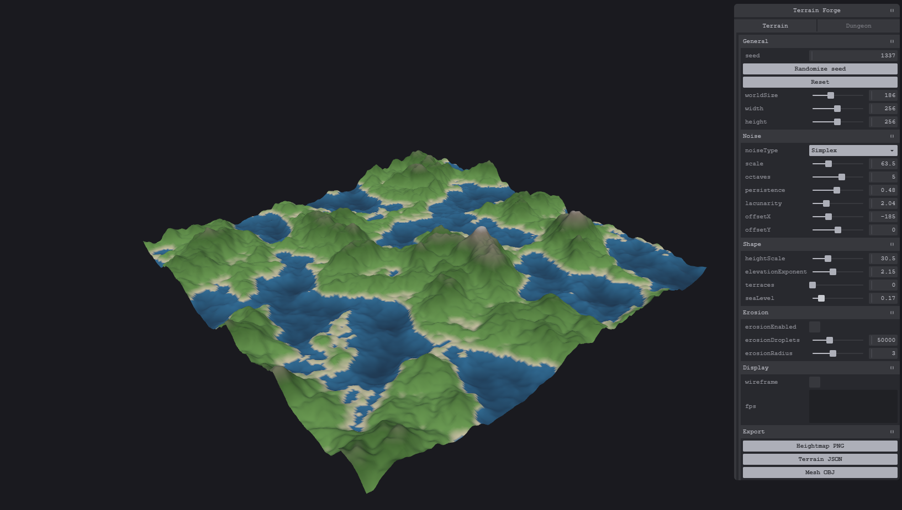
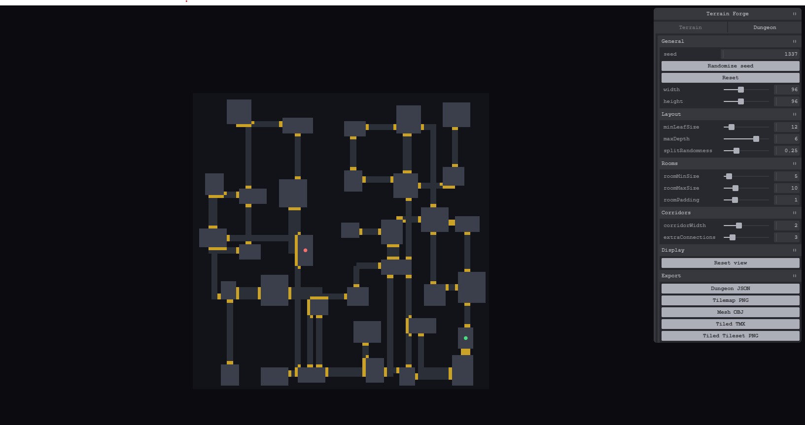

# Terrain Forge

A standalone desktop tool for generating procedural terrains and dungeons for games. Everything runs locally: no backend, no accounts, no external services. Clone it, run it, and start exporting maps you can drop straight into Unity or Godot.



## Features

**Terrain**
- Live Three.js preview with orbit controls
- Perlin and Simplex noise, hand-written, combined through fractal Brownian motion
- Adjustable seed, resolution, scale, octaves, persistence, lacunarity, elevation curve, terraces, sea level
- Optional droplet-based hydraulic erosion
- Elevation-based colouring (water, sand, grass, rock, snow)
- Exports: 16-bit greyscale heightmap PNG, JSON (heights + parameters), OBJ mesh

**Dungeon**
- BSP-based room and corridor generator with extra loop connections
- Live 2D top-down preview with pan and zoom
- Exports: JSON (tiles, rooms, connections), 8-bit tilemap PNG, extruded mesh OBJ, Tiled TMX + tileset



## Download

Prebuilt Windows and Linux builds are available on the [Releases](https://github.com/LorenzoRonconi00/terrain_forge/releases) page — download and run, no build step required.

## Getting started

```bash
npm install
npm start
```

## Scripts

| Command | Description |
| --- | --- |
| `npm start` | Run the app in development with hot reload |
| `npm run build` | Build the production bundle into `out/` |
| `npm run typecheck` | Type-check main, preload and renderer |
| `npm run lint` | Lint the codebase |
| `npm test` | Run the unit tests |

## Export formats

All exports for a given grid share the same coordinate system:

```
worldX = (col / (width - 1) - 0.5) * worldSize
worldZ = (row / (height - 1) - 0.5) * worldSize
```

**Terrain heightmap PNG / JSON** store heights normalised to `[0, 1]` and stretched to the used range. Absolute elevation:

```
worldY = minHeight + h * (maxHeight - minHeight)
```

`minHeight` / `maxHeight` (world units) are included in the JSON; in the PNG, `h = pixel / 65535`.

**Terrain OBJ** is already in world units, Y-up, with smooth normals.

**Dungeon JSON** exposes `tiles[row * width + col]` (wall / floor / corridor / door, see `tileLegend`), `rooms`, `connections`, and the `start`/`end` room ids.

**Dungeon tilemap PNG** is one pixel per tile.

**Dungeon OBJ** is one world unit per tile, walls extruded only where they border walkable space.

**Dungeon Tiled export** produces a `.tmx` map plus a matching `dungeon-tileset.png`, save both in the same folder and open the map in Tiled, or import directly through Unity's or Godot's Tiled importers.

## Architecture

```
src/
  main/        Electron main process, window and file-save IPC handler
  preload/     contextBridge exposing window.api.saveFile
  shared/      IPC channel name and message types
  renderer/
    core/      pure generation logic, no Three.js/DOM/Electron, fully unit-tested
      prng.ts, hash.ts
      noise/       Perlin, Simplex, FBM
      terrain/     params, elevation curve, heightfield, geometry, erosion
      dungeon/     BSP, rooms, corridors, dungeon
      export/      PNG/JSON/OBJ/TMX encoders
    three/     Terrain viewer and mesh
    canvas/    Dungeon 2D view
    ui/        Stores and Tweakpane panels
    app/       Shell wiring the two modules together
```

## Testing

```bash
npm test
```

Vitest covers the whole `core/` layer, noise properties, the heightfield and dungeon generation pipelines, and every exporter (PNG chunk/CRC structure, JSON schema, OBJ topology, TMX layout).

## License

MIT